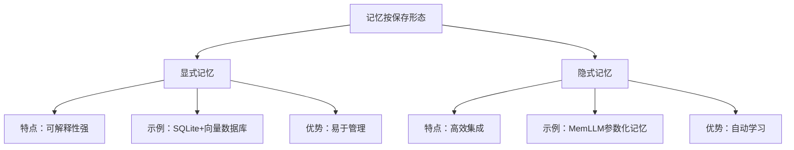
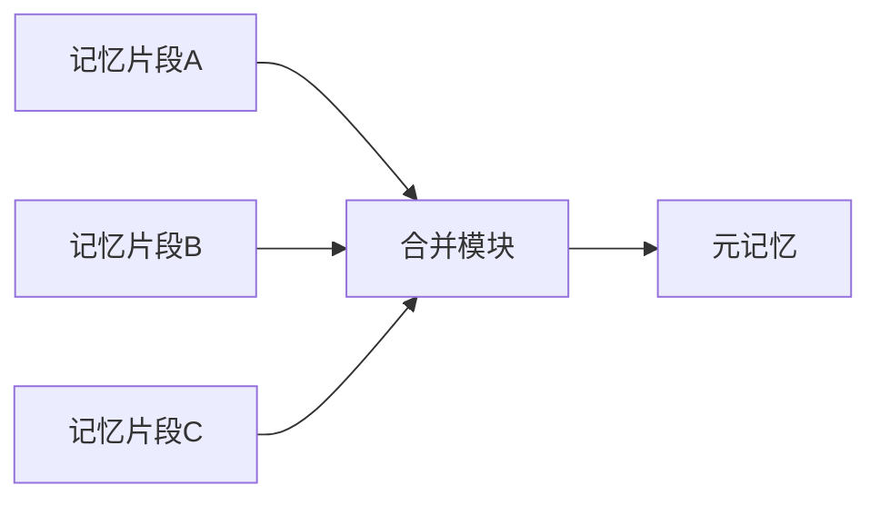
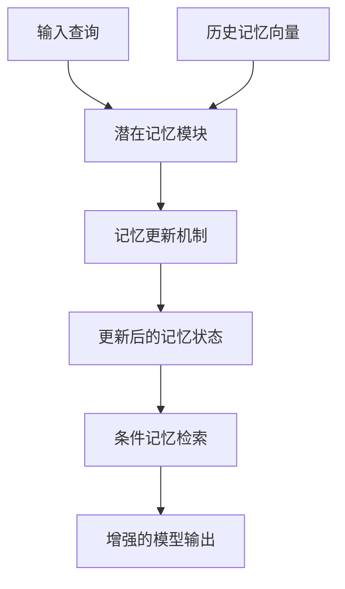

本文系统性地综述了智能体记忆（Agent Memory）领域的核心概念、关键技术与最新进展。首先分析了在人工智能从“人类数据时代”迈向“体验时代”（Era of Experience）的范式转变中，记忆系统是智能体实现持续学习、在线改进和塑造个性的核心基石，是突破大语言模型上下文困境、将被动工具转化为主动智能伙伴的关键。其次，从多维度对记忆进行了分类梳理，详细阐述了记忆的完整操作生命周期，包括外部的读写与内部的合并、反思和删除等管理策略。最后，重点探讨了记忆的实现方式，包括检索式记忆（如向量与图匹配）、参数化记忆（如微调、LoRA、知识编辑）以及新兴的潜在记忆（如：MemoryLLM、MemGen）等前沿技术，揭示了记忆系统从外部存储到与模型深度集成的演进趋势。

## 1 背景

本章主要介绍智能体（Agent）记忆系统产生的技术背景及其必要性。首先，我们将分析大语言模型（LLM）在处理长上下文时面临的困境；接着，我们探讨“经验时代”(Era of Experience) 下智能体学习的范式转变；最后，我们将厘清“工具”与“智能体”之间的本质区别，为理解记忆系统的重要性奠定基础。


### 1.1 LLM 上下文困境

大语言模型虽然展现出强大的生成能力，但其核心架构在处理长上下文时存在固有局限性。**上下文窗口的物理限制**是一个明显问题——无论窗口多大，线性增长的序列长度都会导致显存占用和计算延迟的急剧上升，使得本地部署难以落地。

更本质的挑战在于，**上下文并不等同于记忆**。当开发者过度依赖扩大上下文窗口来容纳更多信息时，常会遭遇多种“上下文失控”现象：

- **上下文污染**：当幻觉或错误信息进入上下文并被反复引用时，代理会发展出无意义的策略，重复追求无法实现的目标。例如在记忆系统中，一次情绪化表达“这节课烦死了，根本没用”可能被错误地概括为“用户认为《课程C》没有价值”，从而长期污染后续交互。
- **上下文干扰**：上下文过长时，模型会过度关注上下文中的过去动作，而较少利用其训练得到的策略，导致输出结果“固化”且质量下降。
- **上下文混淆与冲突**：多余的工具定义或不相关信息会使模型选择错误的工具，而多智能体架构中不同来源的信息矛盾会导致输出不可靠。

这些困境表明，单纯扩大上下文窗口不是解决方案，需要更智能的记忆管理机制。

### 1.2 Era of Experience

当前，人工智能正经历从"人类数据时代"向"**体验时代**"（The Era of Experience）的深刻转变。这一转变的核心在于，AI智能体不再仅仅依赖静态的训练数据，而是通过与环境持续交互产生的直接经验来学习与进化。正如DeepMind研究所指出的，体验正成为AI发展的新动能，而**记忆系统**正是支撑这一转变的核心架构。

在体验时代，智能体通过"实践出真知"的方式学习：在复杂环境中执行动作、观察结果，并根据反馈调整策略。这种学习模式产生了海量的交互经验，包括成功案例、失败教训、用户偏好和任务上下文。如果没有有效的记忆机制，这些宝贵的经验将随着每次会话结束而消散，无法积累知识，每个新任务都需从头开始。

**记忆系统是体验能够转化为能力的关键桥梁**。它使得智能体能够：

- **保留历史经验**：将成功的解决方案、有效的推理路径存储下来，避免重复探索
- **积累领域知识**：在长期交互中构建个性化的知识图谱，理解用户的特定需求和偏好
- **支持持续改进**：通过反思机制从失败中学习，逐步优化行为策略

体验时代的四个关键特征都深度依赖记忆系统的支持：

1.  **持续体验流**需要长期记忆来维持跨会话的状态一致性
2.  **丰富的动作与观察**需要情景记忆来记录完整的交互轨迹
3.  **基于现实的奖励**需要程序记忆来内化成功的行为模式
4.  **非人式推理与规划**需要语义记忆来构建世界的心理模型

因此，记忆不再仅仅是智能体的附加功能，而是体验时代智能体实现持续学习、个性化发展和真正自主进化的**基础架构**。没有强大的记忆系统，体验就只是转瞬即逝的碎片，无法沉淀为真正的智能。

### 1.3 “工具” VS “智能体”

- **工具**本质上是**被动响应**的。它根据特定输入执行预定操作，缺乏目标感知和持续状态跟踪。例如，一个简单的API调用工具，给定输入即产生固定输出，没有历史感知或目标导向。

- **智能体**则是**主动追求目标**的实体。它能够在长时范围内维持状态、进行复杂推理并与环境交互。智能体的核心能力包括**规划**（将高层次目标分解为多步策略）、**工具使用**（调用与协调外部资源）和**记忆**（保留、检索与管理信息）。

记忆系统正是将LLM从被动“工具”转化为主动“智能体”的关键桥梁。没有记忆的Agent永远困在当下，无法积累经验也无法改进。
有记忆的Agent才是“智能体”，没有记忆的Agent只是“工具”而已。

## 2 记忆对 Agent 的价值

本章深入探讨记忆系统对智能体的核心价值。我们将从三个维度展开：解耦“推理”与“数据”以提升系统效能，支持在线改进以实现从“生疏”到“熟练”的转变，以及通过持续学习塑造智能体“个性”。

### 2.1 解耦“推理”与“数据”

智能体的决策质量依赖于两方面：一是其内在的**推理能力**，二是支撑决策的**数据**。记忆系统通过将大量参考信息从决策上下文中剥离，解决了上下文窗口的限制问题。

通过记忆机制，智能体只需从记忆中检索与当前任务最相关的信息，而非将所有历史数据塞入上下文。这种“按需取用”的模式显著**降低了上下文负担**。

记忆系统使智能体能够**维持跨会话连续性**。一个数据质量监控Agent如果能记住哪些数据集经常出问题，就能提前预警而不是每次都从头排查。

### 2.2 在线改进，从“生疏”到“熟练”

记忆使智能体能够通过**反思机制**从历史经验中学习，实现行为模式的优化。这种机制本质上是一种基于自然语言的强化学习。

具体而言，智能体可以定期总结近期行为，识别模式、错误和改进点。例如，通过设计如下反思 prompt ：

```
reflection_prompt = f"""
You are reviewing your recent actions. Based on the following summaries, what patterns,
mistakes, or improvements do you notice?

{recent_summaries}

Provide 3 takeaways and 1 improvement plan for your future tasks.
"""
```

反思结果可以作为元记忆存储，用于指导未来任务。这种**自我批评与修正**的能力，使智能体能够在不断迭代中从“生疏”进阶到“熟练”。

### 2.3 持续学习，在学习中塑造“个性”

记忆系统支持智能体在长期互动中**形成一致的个性化特征**。通过积累用户偏好、交互模式和特定领域的知识，智能体能够发展出独特的“个性”。

例如，Persode日记系统通过整合智能体情景记忆与视觉叙事，基于RAG框架优先检索情感相关记忆，实现高度个性化的语境对话，最终生成符合用户特点的图文日记。这种个性化不是静态设定的，而是通过持续学习和记忆更新逐渐塑造的。

更为重要的是，记忆使智能体能够**追踪长期目标**。数据整理、研究辅助等任务往往跨越多次交互，需要Agent记住目标、理解任务间的依赖关系。这种持续性使智能体从处理单次请求的工具，转变为在追求长期目标过程中持续运作的协作伙伴。

## 3 记忆的类型

记忆的类型按时间跨度分为短期与长期记忆；其中，短期记忆又可以分为感知记忆和工作记忆；长期记忆可以按保存形态分为显式与隐式记忆，或者按用途分为场景、语义与程序记忆。

在 LLM Agent 领域，工作记忆通常对应于模型上下文，因此，我们重点关注长期记忆的机制。


### 3.1 短期记忆

涉及当前会话或近期交互的信息，通常通过对话摘要维持，将长交互历史压缩后重新注入上下文窗口。

### 3.2 长期记忆

则跨越多个会话，保留历史经验和关键信息。早期多采用检索增强生成（RAG），将历史交互存储于向量数据库中并按需检索。M+框架在MemoryLLM基础上引入了可扩展的长期记忆，通过把“过期”隐藏向量写入CPU侧长期记忆池，再用协同检索器拉回最相关记忆，将8B级模型的有效记忆跨度从原本不到20k tokens提升到160k tokens以上。

#### 按保存形态

**显式记忆（Explicit Memory）** 指智能体外部化、结构化的存储内容，通常以文本、向量或图结构等形式存在于数据库或外部模块中。显式记忆具有**可解释性强**、**易于管理**的优点，但可能存在与模型交互效率低的问题。

**隐式记忆（Implicit Memory）** 则指通过模型参数内化的知识。例如，MemLLM实现了基于记忆token的隐式记忆，通过在前向传播中持续更新记忆token，使知识得以自动内部更新。隐式记忆的优势在于**高效集成**和**自动学习**，但可解释性差且更新成本高。



#### 按用途

**场景记忆（Episodic memory）** 记录具体的事件和经历，包括时间、地点、人物等上下文细节。在实现上，通常通过记录交互历史并生成摘要来构建。例如，在SQLite记忆中存储的`memory_events`表就包含了每次交互的输入、输出和摘要。

**语义记忆（Semantic Memory）** 存储从具体经验中提炼的概念、事实和知识，更接近人类对世界的抽象理解。例如，A-MEM系统通过Zettelkasten方法创建相互连接的知识网络，当添加新记忆时生成包含多个结构化属性的综合笔记，包括上下文描述、关键词和标签。

**程序记忆（Procedural Memory）** 指智能体执行任务的操作流程和技能，通常通过反复成功执行特定任务而内化形成。在模型原生范式中，程序记忆逐渐被内化至模型参数中，例如，LLM 后训练中，将工具调用融入推理过程，模型能够学习何时以及如何在策略内部调用多种工具。

## 4 记忆操作

本章系统阐述记忆系统的各类操作，分为外部操作与内部管理两大类。有效的记忆操作是确保记忆系统实用性的关键，不仅涉及基本读写，还包括优化记忆质量的精细管理策略。


### 4.1 外部操作

外部操作指记忆系统与外部环境交互的基本读写功能，是记忆系统的基础接口。

#### 4.1.1 读取

记忆读取的核心是根据当前情境从存储中召回相关信息。高效的读取机制不仅影响智能体的决策质量，也直接关系到系统性能。现代记忆系统通常采用**多级检索策略**：

- **向量检索**：基于语义相似度召回相关内容
- **时间过滤**：优先考虑近期记忆
- **重要性加权**：根据记忆的显著性分数调整检索优先级

A-MEM系统通过动态分析历史记忆以识别相关联结，在存在有意义相似性的地方建立链接，从而实现更精准的记忆读取。

#### 4.1.2 写入

记忆写入决定哪些信息应被存储以及如何存储。原始交互数据通常经过压缩和抽象后才被写入长期记忆。例如，可以通过LLM生成交互摘要：

```python
summary_prompt = f"Summarize this agent interaction:\n\nInput: {input_text}\nOutput: {output_text}\n"
summary = llm.complete(summary_prompt)
```

然后将摘要转为向量存储。研究表明，**存储摘要比存完整对话有效得多**，既节省空间又便于检索。

MemLLM采用了更集成的写入策略，通过在前向传播中持续更新潜在记忆token，使知识得以自动内部更新。

### 4.2 内部管理

内部管理操作专注于记忆系统的优化与维护，确保记忆质量与系统性能随时间不断提升。

#### 4.2.1 合并（merge）

合并操作将多个相关记忆片段整合为一条连贯的元记忆，减少冗余的同时保留关键模式。例如，定期将同一主题的多次交互总结为一条包含核心观点和模式的内存项：



**语义压缩**是一种有效的合并技术——把多个相关事件总结成一条元记忆，减少信息冗余的同时保留关键模式。

#### 4.2.2 反思（refine）

反思是记忆系统实现**在线学习**的核心机制，通过分析和评估历史记忆来优化未来行为。反思循环把被动的存储变成主动的能力提升。

具体实现可以定期触发（如每隔N次交互）反思过程：

```
reflection_prompt = f"""
You are reviewing your recent actions. Based on the following summaries, what patterns,
mistakes, or improvements do you notice?

{recent_summaries}

Provide 3 takeaways and 1 improvement plan for your future tasks.
"""
```

反思结果可以作为元记忆存储，用于指导未来任务。随着新记忆的整合，它们可以触发现有历史记忆的情境表示和属性的更新，从而使记忆网络能够不断优化其理解。

#### 4.2.3 删除（delete）

删除操作维护记忆系统的健康状态，防止信息过时或积累无效内容。删除策略包括：

- **基于时间的淘汰**：自动移除过于陈旧的记忆
- **基于相关性的过滤**：删除长期未被引用的低频记忆
- **基于冲突的解决**：当新旧记忆矛盾时，根据可靠性评估保留更可信的版本

**定期清理数据很重要**。可以设置定时任务，合并相似的记忆或者删掉不再有用的旧记录。

在实践中，智能体记忆的各种操作通常协同工作，形成一个完整的记忆生命周期管理流程。从写入、读取到合并、反思和删除，这些操作共同确保了记忆系统既能积累有价值的历史经验，又能保持高效和相关性，为智能体的持续进化提供支撑。

## 5 记忆的实现方式

本章详细探讨智能体记忆的各种技术实现路径，包括检索式记忆、参数化记忆和潜在记忆三大类。我们将分析各种方法的原理、代表性工作及优缺点，为实践提供技术选型参考。


### 5.1 检索式记忆

检索式记忆通过外部存储和查询机制实现记忆功能，是当前最广泛应用的记忆实现方式。

#### 5.1.1 文本检索

文本检索依赖于关键词匹配或元数据过滤来查找相关记忆。例如，在SQLite记忆系统中，可以通过Agent名称、时间戳等结构化字段查询历史记录。这种方法的优点是**实现简单**、**可解释性强**，但局限于表面语法匹配，难以处理语义相似但表述不同的查询。

#### 5.1.2 向量匹配

向量匹配通过将文本转换为高维空间中的向量表示，并计算余弦相似度等距离度量来检索相关记忆。具体实现通常包括以下步骤：

```python
def recall_related_memories(query, top_k=3):
    query_embedding = embedding_model.embed(query)
    results = pinecone_index.query(vector=query_embedding, top_k=top_k)
    return [r['metadata']['summary'] for r in results]
```

向量检索能捕捉语义相关性，找到表述不同但意思相近的内容。Mem0系统结合向量检索与图结构记忆，在LOCOMO基准测试中超越多种基线。

#### 5.1.3 图匹配

图匹配将记忆组织为节点和边的网络结构，通过图遍历算法发现复杂关系。A-MEM系统基于Zettelkasten方法，创建互联的知识网络：当添加新记忆时，系统分析历史记忆以识别相关联结，在存在有意义相似性的地方建立链接。这种方法的优势在于能**捕获记忆间的复杂关系**，支持**推理链发现**，但实现复杂度较高。

### 5.2 参数化记忆

参数化记忆将知识直接编码到模型权重中，实现更紧密的模型-记忆集成。

#### 5.2.1 微调

全参数微调通过更新模型所有权重来内化新知识，能显著提升模型在特定领域的表现，但计算成本高昂且可能导致**灾难性遗忘**——模型在新知识上过度拟合，丢失原有的通用能力。

#### 5.2.2 LoRA

LoRA（Low-Rank Adaptation）通过低秩矩阵分解注入可训练参数，大幅减少微调参数量。它在原始权重旁添加旁路矩阵，仅训练这些紧凑参数，既保持了预训练知识，又高效适应新领域。LoRA在参数化记忆中平衡了**学习效率**与**知识保留**。

#### 5.2.3 知识编辑

知识编辑是一种**直接修改模型内部参数**以实现记忆更新的参数化方法。与需要更新全部参数的传统微调不同，它通过精确定位存储特定知识的网络层（如MLP和注意力模块），以最小化改动实现知识的插入、修正或删除，为模型记忆管理提供了高效的解决方案。

在具体方法上，主流方法包括：
- ROME和MEMIT实现的定位-修改范式，能够对单一或大规模知识进行精确编辑；
- MEND通过轻量级超网络将梯度映射为紧凑编辑指令；
- REPAIR框架则引入主记忆-侧记忆的双重系统，避免了对原始知识的直接破坏，显著提升了编辑稳定性。

知识编辑的突出优点在于编辑精度高、参数效率优越，能够有效解决知识过时和模型幻觉问题。然而，该方法仍面临知识冲突、泛化能力不足以及可能影响模型原始性能等挑战，是需要进一步研究突破的方向。

### 5.3 潜在记忆（Latent Memory）

潜在记忆是一种新兴的记忆实现范式，它将记忆信息编码到独立于模型的潜在空间中，通过动态更新的隐状态向量来存储和检索知识。与基于检索的记忆相比，潜在记忆实现了记忆系统与模型推理过程的深度集成；与参数化记忆相比，潜在记忆无需反向传播，更加高效；并且可以解决**灾难性遗忘**的问题。

#### 5.3.1 核心概念与工作原理

潜在记忆的核心思想是将记忆表示为**可学习的潜在向量**，这些向量在模型的前向传播过程中动态更新和利用。潜在记忆通过以下机制工作：

- **记忆编码**：将外部信息压缩为紧凑的潜在表示，存储在专门的记忆模块中
- **动态更新**：在推理过程中实时更新记忆状态，捕捉当前的上下文信息
- **条件检索**：基于当前查询自动激活相关的记忆片段，无需显式的检索指令



#### 5.3.2 优势与特性

潜在记忆相比传统记忆方式具有显著优势：

- **无缝集成**：记忆操作与模型推理自然融合，无需额外的检索调用
- **持续学习**：支持在线学习和记忆更新，适应动态环境
- **计算效率**：避免了传统RAG中的显式检索开销
- **上下文感知**：记忆激活程度随对话上下文动态调整


#### 5.3.3 典型案例： MemoryLLM、MemGen

**[MemoryLLM](https://arxiv.org/abs/2402.04624)**开创性地实现了参数化记忆，通过在前向传播中持续更新潜在记忆token，使知识得以自动内部更新。具体而言，MemoryLLM在Transformer每一层都加入N个Memory Tokens，在生成过程中，这些Memory Tokens会作为每一层的Prefix，通过Cross-Attention将信息注入后续层，使模型能“看到”保存在Memory Pool中的历史信息。

**[MemGen](https://arxiv.org/abs/2509.24704)** 通过在上下文中插入潜在记忆token，来使用记忆内容。它包括记忆触发器和记忆编织器两个组件，前者决定何时触发记忆查询；后者进行记忆的读取和写入。这种方式更加类似人类的记忆机制，能够在整个推理过程中回忆和增强上下文，从而产生一个记忆和认知紧密交织的循环。

## 6 总结

智能体记忆系统是将大语言模型从被动工具转化为主动协作伙伴的关键技术。通过系统回顾记忆系统的背景、价值、分类、实现方式和管理操作，我们可以看到该领域正经历从外部流水线向模型原生范式的深刻转变。

记忆系统不仅解决了LLM的上下文限制问题，更重要的是支持智能体通过经验积累实现在线改进和个性化发展。多种记忆类型和实现方式各有优劣，在实际应用中常常组合使用。而记忆的高效管理——包括合并、反思和删除等操作——对维持系统健康至关重要。

未来，随着模型原生范式的成熟和多模态交互的普及，智能体记忆系统将面临更广阔的发展空间。更高效的记忆机制、更智能的记忆压缩与检索策略，以及更安全的记忆隐私保护，都将成为重要的研究方向。最终，拥有高质量记忆系统的智能体将更接近人类的持续学习模式，在复杂、动态的环境中实现真正的自主进化。
